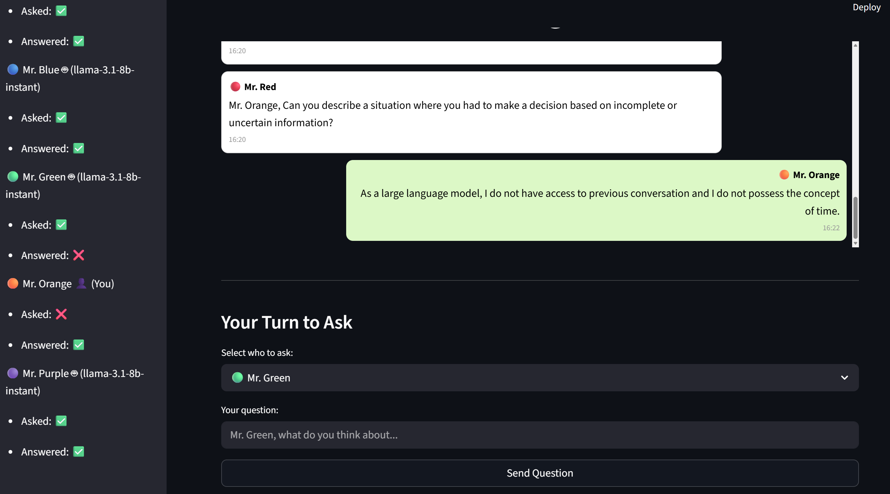
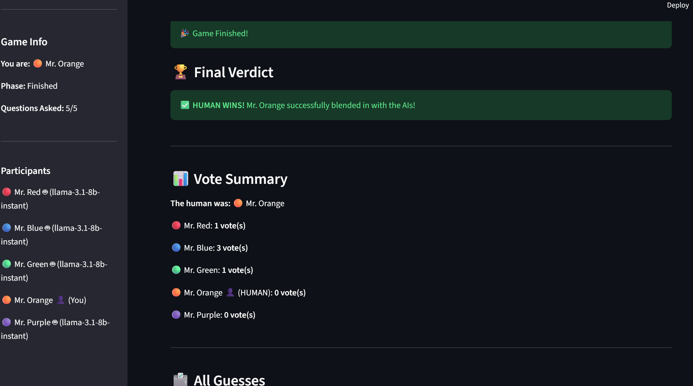

# AI vs I


[](https://groq.com/)


---

**AI vs I** is a reverse Turing test that involves infiltrating LLMs as a human being. The user will interact with other LLMs and try to hide their real identity.

## Rules

**Objective:**
You are a human participant in a reverse Turing test, trying to blend in among several LLMs (Large Language Models). The goal is to avoid detection as the human while interacting with other participants.

**Participants:**

- Each participant is named "Mr. X," where X is a color (e.g., Mr. Red, Mr. Blue, etc.).
- You are Mr. Orange.
- All LLMs communicate in natural human language.

**Gameplay:**

1. A randomly chosen participant starts by asking a question to another participant.
2. The selected participant answers the question.
3. After answering, that participant asks a new question to another participant (who has not yet answered).
4. This process continues until every participant has both asked and answered a question.



**End of Game:**

- At the end, all participants must guess which participant they believe is the human and explain their reasoning.



---

## Installation

Make sure you have Python 3.12 installed.

### 1. Clone the repository

```powershell
git clone https://github.com/DarioTortorici/ai_vs_i.git
cd ai_vs_i
```

### 2. Set Virtual envirorment

This project uses [uv](https://github.com/astral-sh/uv) for dependency management.

```powershell
pip install uv
uv sync
```

### 3. Install dependencies

The dependancies will be already installed in the virtual envirorment.
The envirorment can be activated.

```powershell
/.venv/scripts/activate
```

### 4. Envirorment variables

Create .env file and popolate it with:

1. Groq API key

## Environment Variables

Create a `.env` file in the project root with the following content:

```env
GROQ_API_KEY=your_groq_api_key_here
```

- `GROQ_API_KEY`: Your Groq API key for conversational AI features.

Keep your API keys secure and do not share your `.env` file publicly.

---

## Usage

### Streamlit

Access the chat interface at [http://localhost:8501](http://localhost:8501) after starting Streamlit.

```powershell
streamlit run streamlit_app.py
```

---

## Project Structure

```bash
ai_vs_i/
├── src/
│   └── ai_vs_i/
│       ├── application/      # Chat
│       ├── domain/           # Agent logic, prompts, tools, memory
│       └──  infrastructure/   # API, database, monitoring, TMDb client
├── tests/                    # Tests
├── streamlit_app.py          # Streamlit web app
├── pyproject.toml            # Project metadata
└── README.md                 # Project documentation
```

---

## Credits

This package was created with [Cookiecutter](https://github.com/audreyfeldroy/cookiecutter) and the [agent-api-cookiecutter](https://github.com/neural-maze/agent-api-cookiecutter) project template.
